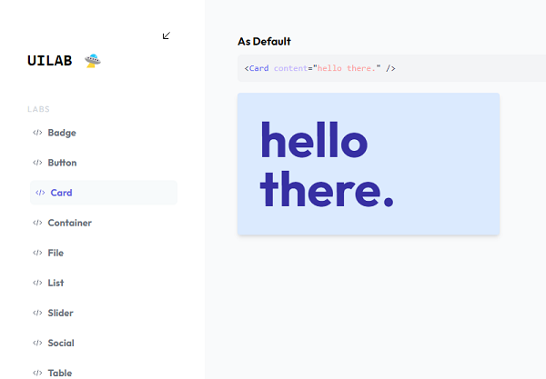

<h3 align="center">uilab</h3>

<p align="center">A live component developing environment, powered by <a href="https://vitejs.dev">vite</a>.</p>

<p align="center">
  
</p>

### Getting Started

From scratch, uilab supports the same templates as vite:

  ```sh
  pnpm create uilab
  ```

### Example lab

A lab must end in `.lab.[ext]` and be named exactly as the component it is testing: `Card.lab.vue`

  ```js
  // Hello.lab.jsx
  import Hello from './Hello'

  export const asDefault = <Hello text="hola" />
  export const asUppercase = <Hello text="HOLA" />
  ```

  if an exported "experiment" prop has a dependency of another component, export a `deps` object.

  ```js
  // Hello.lab.jsx
  import Hello from './Hello'
  import World from './World'

  export const asDefault = <Hello text={World} />
  // this is needed
  export const deps = { World }
  ```
### Adding uilab to an existing vite project


1. Install uilab framework specific dependencies:
```sh
// react
pnpm add -D react-router-dom react-element-to-jsx-string react-live
```
2. Install NPM packages
  ```sh
  pnpm add @nosocks/uilab
  ```
3. Replace your main App component
  ```js
  // import from your framework of choice
  import { AppComponent } from '@nosocks/uilab/react'
  // this styles are required for things to look pretty /ᐠ｡ꞈ｡ᐟ\
  import '@nosocks/uilab/react/style.css'

  // we use vite glob() to get an object of dynamic components imports
  const components = import.meta.glob('./testui/**/*.jsx')

  const App = () => <AppComponent components={components} sidebarTitle="UITEST" />
   ```

uilabs is just a set of components that receives props to render your components from a specific directory. `components` must come from vite API, we use `import.meta.glob` to load all components dynamically.

  ```js
    // react
    <AppComponent
      componentsGlob={import.meta.glob('./components/**/*.jsx')}
      sidebarTitle="COOL_LAB"
    />
  ```


## Roadmap

- [ ] support vue, vue-ts
- [ ] support svelte, svelte-ts
- [ ] support preact, preact-ts
- [ ] support vanilla, vanilla-ts
- [ ] support lit, lit-ts


<p align="right">(<a href="#top">back to top</a>)</p>
